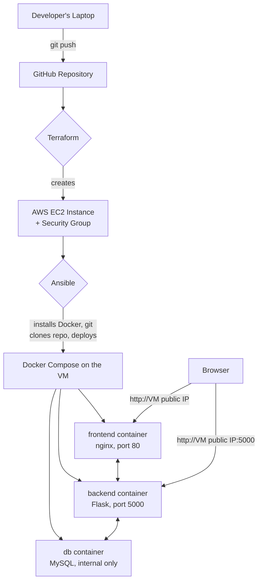
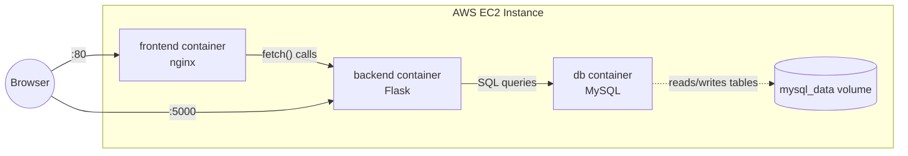
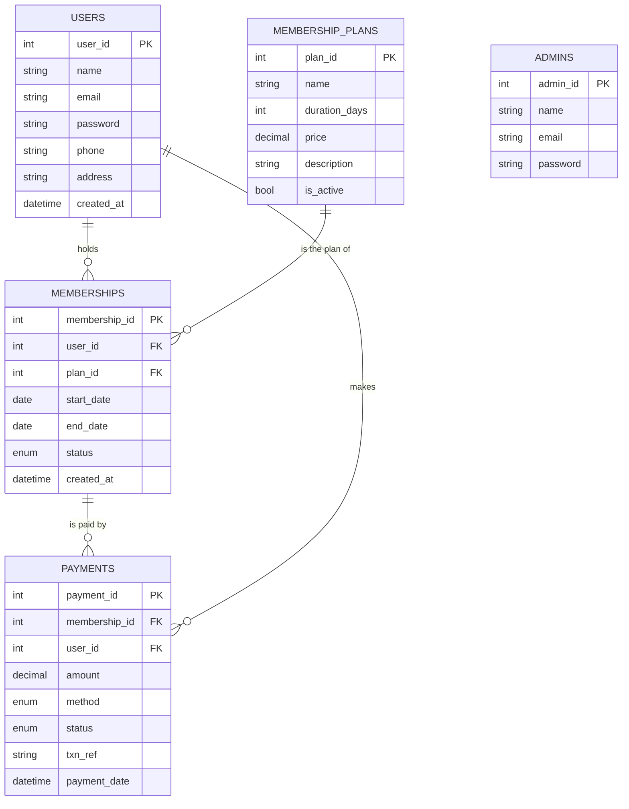
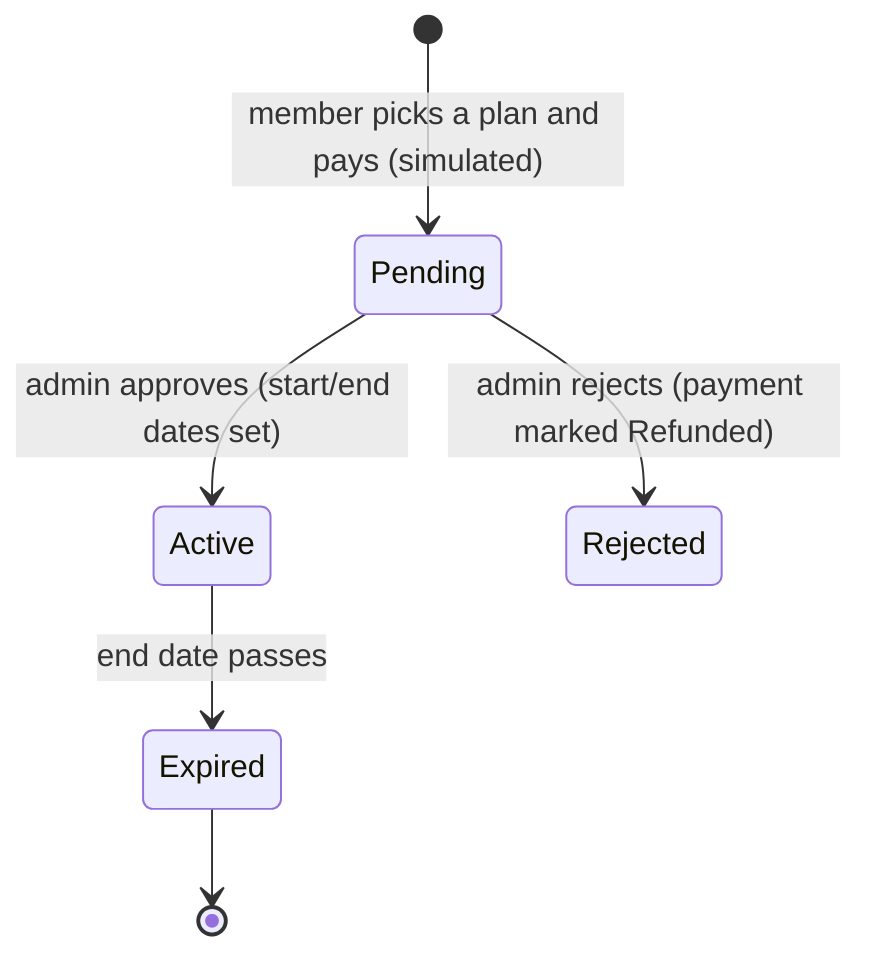
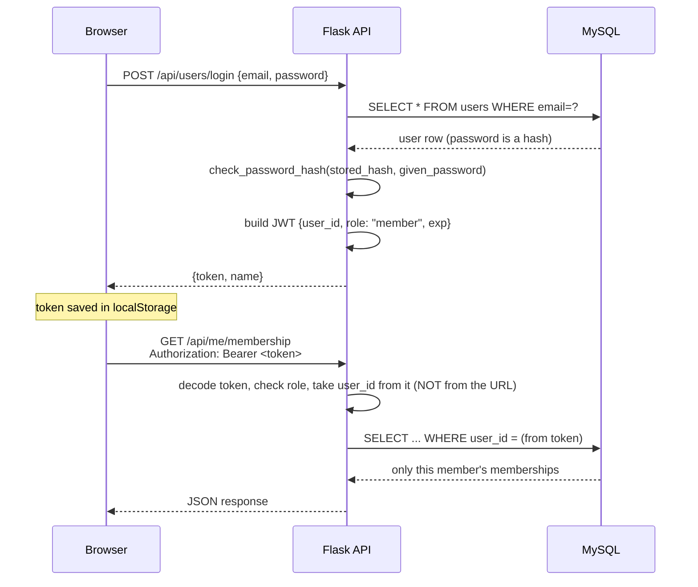
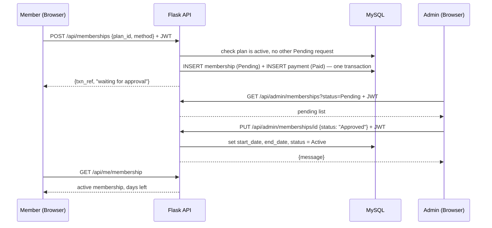

# Architecture — Gym Membership Portal

Diagrams and data flows: the DevOps pipeline, the running containers, the database, and the key request flows.

---

## 1. Deployment Pipeline (the DevOps part)

Code goes to GitHub → Terraform creates the server → Ansible configures it and deploys the app → Docker Compose runs the 3 containers → the browser talks to the frontend and backend directly.

---

## 2. Container & Volume Layout

The `mysql_data` volume lives outside the container's own filesystem, so `docker compose down` then `up` keeps all members, memberships and payments. Only `docker compose down -v` deletes it (and re-seeds the demo data on the next start).

---

## 3. Database Schema (ER Diagram)

`ADMINS` stands alone: admins are seeded in `schema.sql` and never relate to member data.

---

## 4. Membership Lifecycle

- **Renewing** creates a brand-new membership row, so history is kept. If the member is still active, the renewal starts the day after the current one ends — no paid days are lost.
- **Expiry** has no background job: before any read that shows membership status, the backend runs `UPDATE memberships SET status='Expired' WHERE status='Active' AND end_date < CURDATE()`.
- A member can have only one Pending request at a time.

---

## 5. Request Flow — Login & Authorization

The server never trusts a client-supplied ID for "whose data is this" — only the identity verified through the token's signature.

---

## 6. Request Flow — Buying a Plan and Getting Approved

---

## 7. Security Model Summary

| Boundary | Enforced by |
|---|---|
| Must be logged in | `auth_required` decorator checks a valid JWT on every protected route |
| Must be the right role (member vs admin) | The same decorator compares `payload["role"]` and returns 403 otherwise |
| Members only see their own data | Routes use the `user_id` from the verified token, never one from the request |
| Admins can't be self-registered | There is no admin registration endpoint — admins exist only in the seed data |
| Passwords | Hashed with Werkzeug's `generate_password_hash`, never stored or compared in plain text |
| SQL injection | Every query uses parameterized placeholders (`%s`) |
| XSS | The frontend escapes all data before inserting it into the page (`escapeHtml`) |
| Payments | Simulated — no card data is ever collected or stored |
